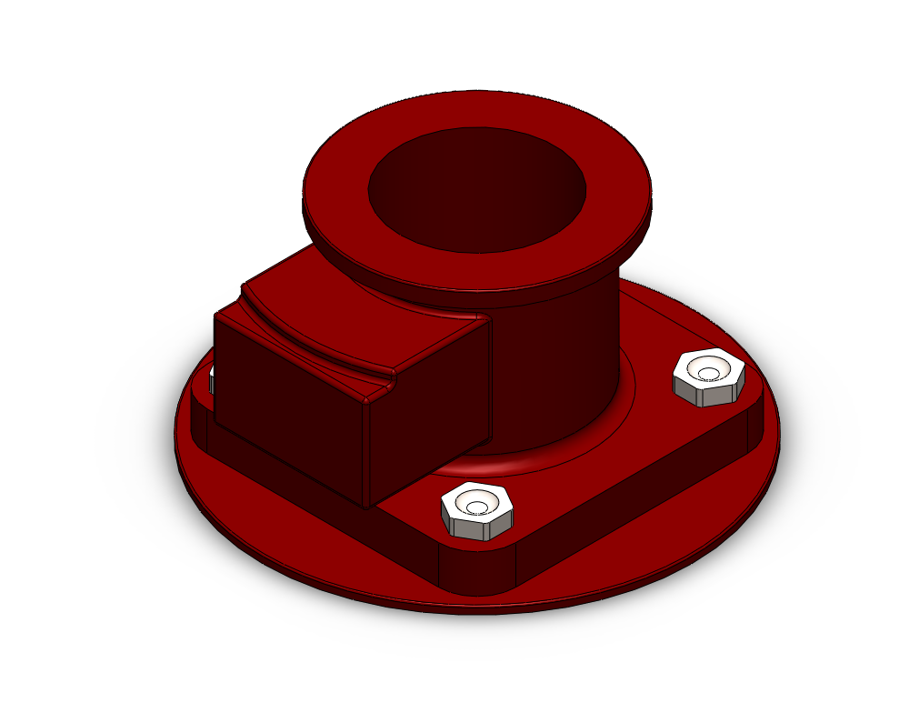
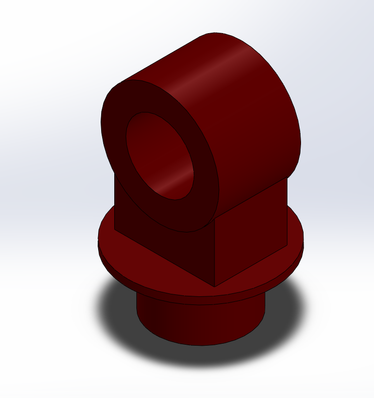
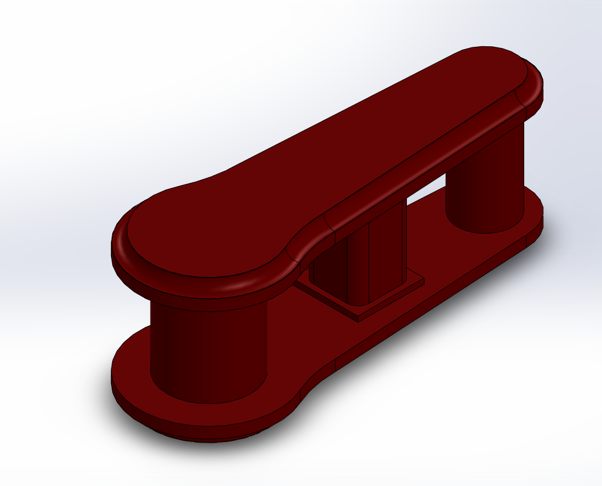
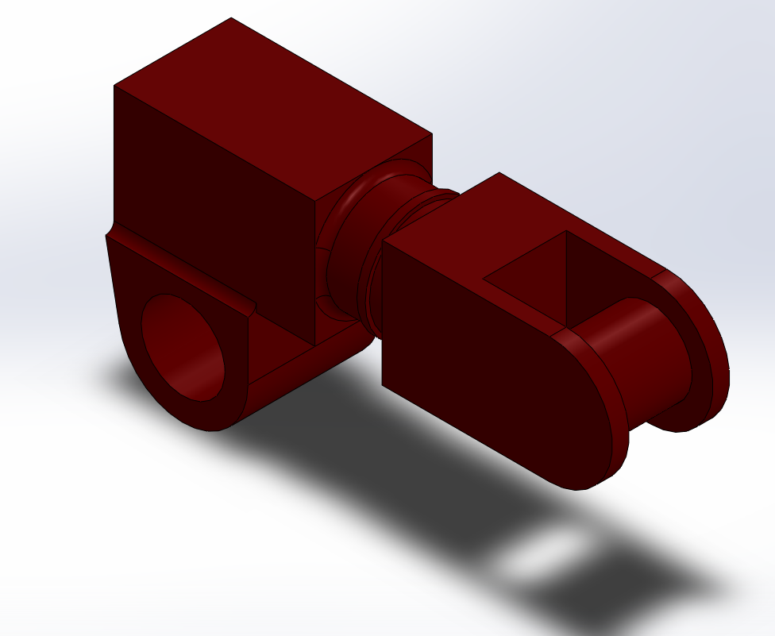
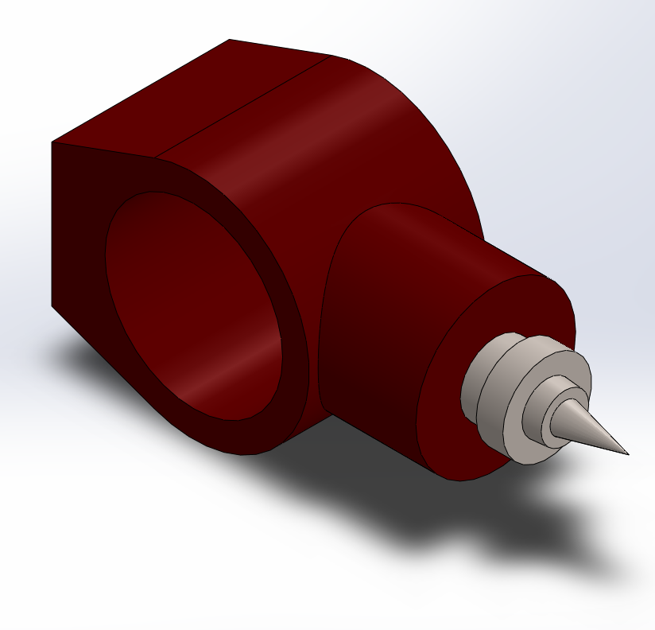
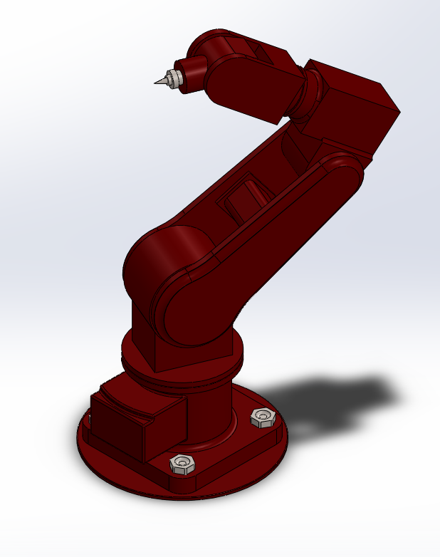
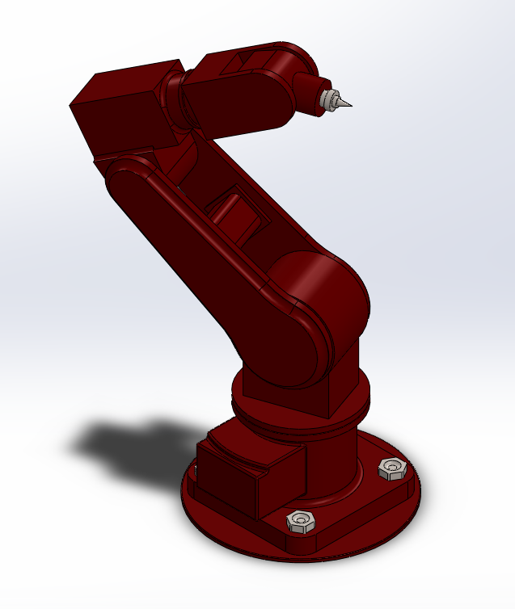

# 🤖 6-DOF Modular Robotic Arm – SolidWorks Design

This project presents the mechanical design of a **6-Degree-of-Freedom (6-DOF) robotic arm** created in SolidWorks. It includes all part files, the full assembly, and a demonstration of the modeling process. The arm is designed to be modular, suitable for robotic manipulation tasks, simulation, or future integration with control systems.

---

## 🔧 Components
- `Base`: Stationary foundation of the arm  
- `Link 1 – 4`: Interconnected links providing full movement across 6 axes  
- `End Effector`: A basic gripper or tool mount (modular design)  
- `Assembly`: Full robotic arm assembled using mechanical mates

## 🎥 Demo

## 💡 Skills Demonstrated
- SolidWorks 3D Modeling (Parts and Assemblies)
- Parametric Design
- Use of Mates and Constraints
- Motion Study and Range of Motion Analysis
- Mechanical Modularity for Robotics

## 🛠️ Tools Used
- SolidWorks

## 📌 Future Improvements
- Add actuator placeholders (servo mounts)
- Export as STEP/IGES for external simulation (Gazebo, Unity, etc.)
- Integrate sensors or gripper mechanics for mechatronics functionality

---

## 📸 Screenshots

